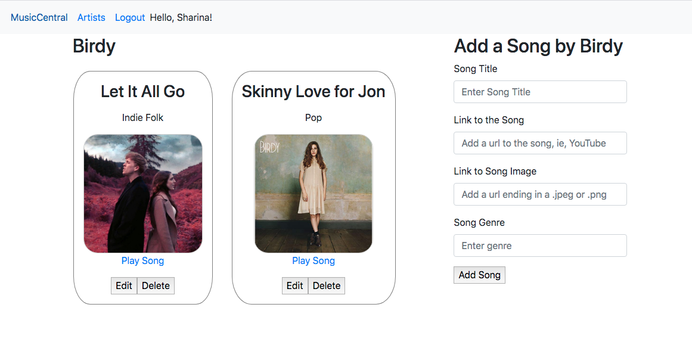
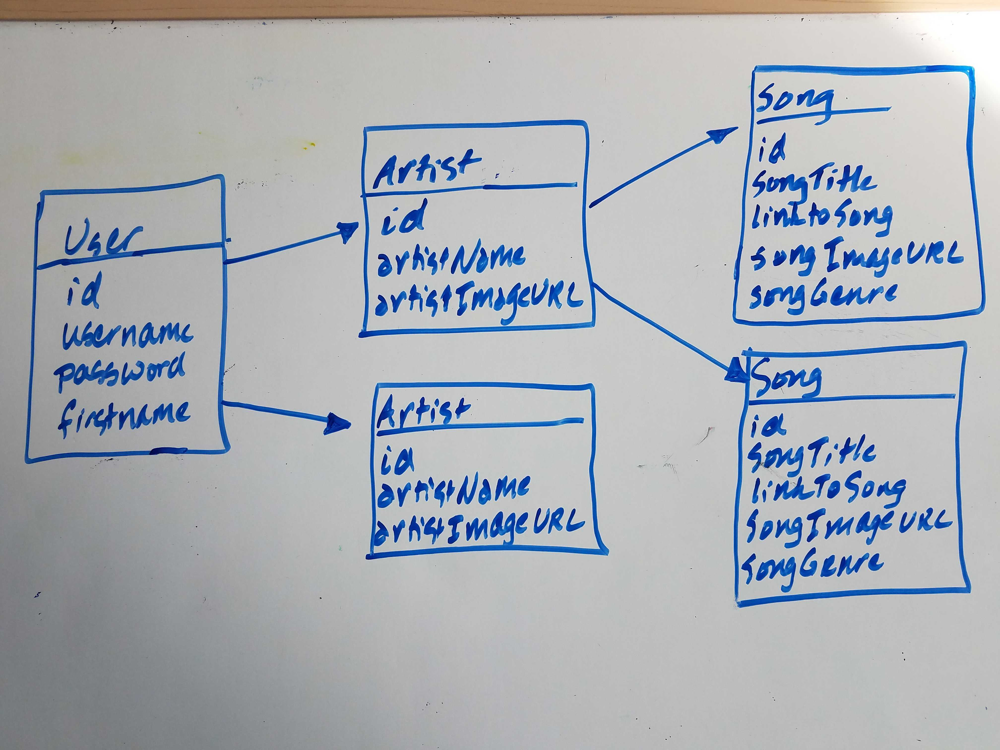
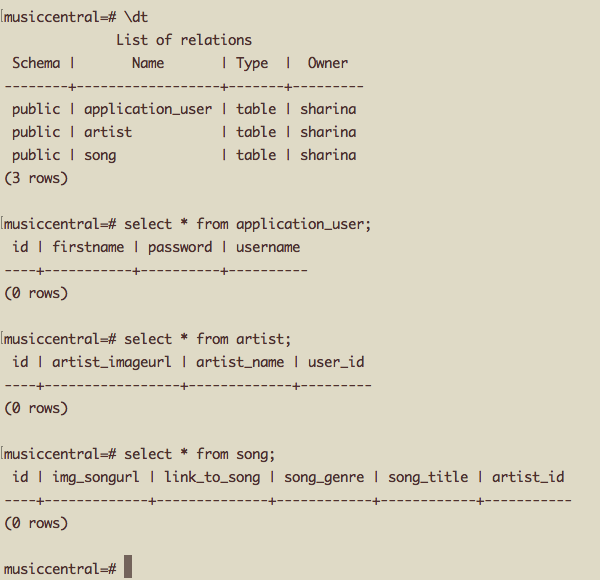
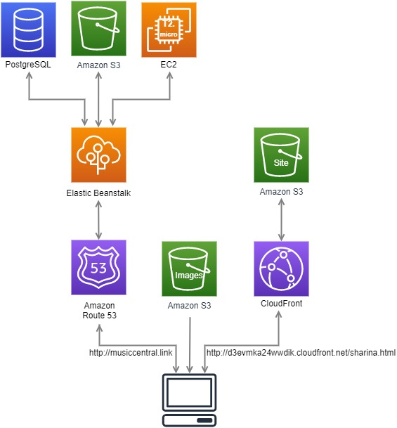

# MusicCentral
A fullstack Java application and RESTful API that lets a user save information about favorite artists and music. A user can peruse their music favorites and play their song of choice, by clicking on a song that opens up their preferred music site, such as YouTube.

MusicCentral is currently deployed on via both Heroku and AWS
* [See it live on Heroku](https://yourmusiccentral.herokuapp.com/)
* [See it live on AWS](http://musiccentral.link/)

While MusicCentral is functional, it is still under construction, so it will look a little different every time you signin. 

MusicCentral, besides helping to organize some music, served as a learning playground for several AWS services.

# Contributor
Sharina Stubbs

### About
Java software developer with prior experience in medicine, yacht-racing, and music (at one time, was pretty decent as a string base player). Strives to write clean and intelligent code, maintain a solid sense of humor, a learning mindset and an ever-improving emotional IQ, not necessarily in that order.

Find me on [LinkedIn](https://www.linkedin.com/in/sharina-stubbs/).

# Version
This is currently version 2.0; a version that uses several AWS services for deployment

# Tech Used
* Java
* Thymeleaf
* PostgreSQL
* Spring MVC (and Spring Boot)
* JQuery
* Bootstrap
* AWS Services
  * S3 - stores splash page image(s) and hosts a static website that is about the developer
  * CloudFront - a web distribution is created for the static website hosted in the S3 bucket.
  * Elastic Beanstalk (with a PostgreSQL database) that hosts the Java application
  * Amazon Route 53 - hosts domain name and routes traffic to the elastic beanstalk environment

# Dependencies
(descriptions are from the Spring Initializer, at `start.spring.io`)
* Spring Data JPA
  * To persist data in SQL stores with data persistence API using Spring Data and Hibernate.
* Spring Security
  * Highly customizable authentication and access-control framework for Spring applications.
* Spring Boot DevTools
  * Provides fast application restarts, LiveReload, and configuration for enhanced development experience.
* PostgreSQL Driver
  * A JDBC and R2DBC driver that allows Java programs to connect to a PostgreSQL database using standard, database independent Java Code.
* Thymeleaf
  * A modern server-side Java template engine for both web and standalone environments. Allows HTML to be correctly displayed in browsers and as static prototypes.
* Spring Web
  * Build web, including Restful, applications using Spring MVC. Uses Apache Tomcat as the default embedded container.

# Key-Words
* Relational Database Management System
* RESTful API / Services
* CRUD
* Object Oriented Programming
* Model-View-Controller (MVC)
* AWS Services

# User Stories
Please see file in repo, called USERSTORIES.md

# Domain Modeling
Pending.

# Database
PostgreSQL, a free and open-source relational database management system, is used to store data about the user, the artists and the songs.

## Database-Entity-Relationships

## Schemas

## AWS Architectural Diagram

# How to Run the  Application via a Local Server
* Clone MusicCentral from my Repo
* If you are a Windows user, open the file called application.properties (`music-central > src > main > resources > application.properties`) and add your PostgreSQL username and password to the environmental variables. (If you're a MacOS user, there is no need).
* Make sure you have an account with PostgreSQL and that you have PSQL installed.
* Navigate to the project in your terminal, start PSQL, and make a new database called `musiccentral`.
* You can start the app by typing in `$ ./gradlew bootRun`
* Go to localhost:8080 to see and use the app

# Lessons Learned in this App
### SpringMVC
* It is way too easy to overlook adding in a very necessary annotation, such as @Controller
* Scroll down to read every error message; the one near the bottom might be the very one you're looking for.
* Forms are the devil - particularly when you think it's a good idea to copy paste part of the form, and you forget to update the `name=`.

## AWS Services
### S3
* It is very easy to store an image on S3 after you make a bucket, and then use it in your website.
  * After making sure the image is public, you just copy the link, and add it to your code.
* S3 doesn't just store images or video; it can host an entire static site with multiple files. 
  * It scales automatically as the website changes in size and popularity - great for when you suspect a sudden and large increase number of users.
  * Wordpress cannot be hosted on S3, and dynamic websites cannot be hosted on S3. 
* You can use bucket policies to make entire S3 buckets public. 
  * Saves time when uploading images or files, so you don't have to make each individual one public.
  * Appropriate for when you're using the bucket to host a static site.
* styles.css does not go in a static folder; it gets uploaded as a file, so just link directly over to it from the html file.
* You can make a custom error page super easily - just make it, call it error.html. and when you are setting up the static site on AWS, you tell it to go to that error page.

### CloudFront
* Cloudfront is a genius idea. 
* When the first user accesses the site, the html page is pulled into an edge location closest to the user. Every user in that vicinity for a period of time then accesses the file from the edge location. 
  * Improves speed and retains quality. 
  * Content is cached in that edge location.
  * Can be used with an S3 Bucket, an EC2 Instance, an Elastic Load Balancer or Route53.
* Cloudfront is a networking tool; it's in `Networking & Content Delivery` on the AWS Console, b/c it's a Content Delivery Network (CDN), which consists of a collection of Edge Locations.
  * Can create a web distribution or a RTMP distribution (for media files).
* Used for the S3 Bucket that hosts the static About Me page. 
* To actually use cloudfront as a url to a static webpage, once you've created the distribution, you copy the domain name, tack the file name of the html page to the end of it, and add http to the beginning of it. Put it in your code, like so:
  `href="http://d3evmka24wwdik.cloudfront.net/sharina.html"`
  
### Elastic Beanstalk
* Used to deploy applications to the cloud without dealing with the infrastructure running those applications
* Handles details of capacity provisioning, load balancing, scaling, and application health monitoring
* Because I used an already existing app, I had to build a jar file from the terminal, `./gradlew bootJar`, inorder to have a file to upload to AWS.
* Initially made an unstable environment by immediately uploading the jar file. Removed it, then simply started with a "Sample Application".
* Because this app has a postgres database, I had to set up an AWS postgres database ... creation of this environment does not happen quickly... and setting up the environmental variables was only slightly intuitive
  * POSGRESQL_PASSWORD <password created during AWS database setup>
  * POSTGRESQL_USERNAME <username created during AWS database setup>
  * DATABASE_URL <postgresql://url-of-database-found-in-databases-connectivity-and-security:5432/database-name-found-in-databases-configuration
* When you make the jar file (to hold all the app files as one file), you can check that the file runs properly by adding the environmental variables to the env
  * `export DATABASE_URL=postgresql://localhost:5432/musiccentral`
  * export username and password variables if you're a PC user
  * check that the environmental variables got stored with the terminal command `env`
  * run the app from the terminal by typing in `java -jar build/libs/musiccentral-0.0.1-SNAPSHOT.jar`, which is the command followed by the file location.
  * Once convinced everything works fine with the file, upload it to the app on elastic beanstalk

### Amazon Route 53
* To route DNS traffic to the elastic beanstalk environment
* Info about routing to the elastic beanstalk environment [here on AWS](https://docs.aws.amazon.com/Route53/latest/DeveloperGuide/routing-to-beanstalk-environment.html)

### Satisfaction
* It's very satisfying to interact with the cloud, and get the cloud and an app interacting with each other. 
* The process of connecting to the cloud makes a lowly little HTML page something greater than it actually is.

# Stretch Goals to Consider
* Set up a many to many relationship between users so a user can follow other users and see what music they like / other users can follow signed in user.
  * Can view and be notified of addition of artists and/or songs, and be exposed to different genres. 
* Display a notification to user when other users add an artist. Consider WebSockets or AWS 
  * Using WebSockets, make notifications system show updates in real time, not just when the page refreshes.
* AWS Services
  * Set up a load balancer
  * Allow user to get image from their computer, and upload it to S3, then grab it from S3 to display as their profile image
  * Cloud watch events processed by a lambda function
 
