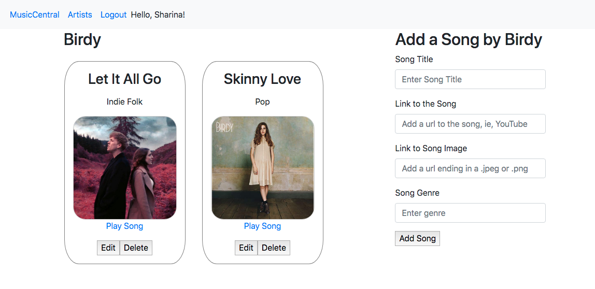

# MusicCentral
A fullstack Java application and RESTful API that lets a user save information about favorite artists and music. A user can peruse their music favorites and play their song of choice, by clicking on a song that opens up their preferred music site, such as YouTube.

MusicCentral is currently deployed on Heroku, and can be used to [keep track of your favorite music here](https://yourmusiccentral.herokuapp.com/), though remember, while MusicCentral is functional, it is still under construction, so it will look a little different everytime you signin. 

## Tech Used
* Java
* Thymeleaf
* PostgreSQL
* Spring MVC (and Spring Boot)
* JQuery
* Bootstrap

# Contributor
Sharina Stubbs

### About
Java software developer with prior experience in medicine, yacht-racing, and music (at one time, was pretty decent as a string base player). Strives to write clean and intelligent code, maintain a solid sense of humor, a learning mindset and an ever-improving emotional IQ, not necessarily in that order.

Find me on [LinkedIn](https://www.linkedin.com/in/sharina-stubbs/).

# Dependencies
(descriptions are from the Spring Initializer, at `start.spring.io`)
* Spring Data JPA
  * To persist data in SQL stores with data persistence API using Spring Data and Hibernate.
* Spring Security
  * Highly customizable authentication and access-control framework for Spring applications.
* Spring Boot DevTools
  * Provides fast application restarts, LiveReload, and configuration for enhanced development experience.
* PostgreSQL Driver
  * A JDBC and R2DBC driver that allows Java programs to connect to a PostgreSQL database using standard, database independent Java Code.
* Thymeleaf
  * A modern server-side Java template engine for both web and standalone environments. Allows HTML to be correctly displayed in browsers and as static prototypes.
* Spring Web
  * Build web, including Restful, applications using Spring MVC. Uses Apache Tomcat as the default embedded container.

# Key-Words
* Relational Database Management System
* RESTful API
* Object Oriented Programming
* Model-View-Controller (MVC)

# User Stories
Please see file in repo, called USERSTORIES.md

# Domain Modeling
Pending.

# Database
PostgreSQL, a free and open-source relational database management system, is used to store data about the user, the artists and the songs.

## Database-Entity-Relationships

## Schemas

# How to Run the  Application via a Local Server
* Clone MusicCentral from my Repo
* If you are a Windows user, open the file called application.properties (`music-central > src > main > resources > application.properties`) and add your PostgreSQL username and password to the environmental variables. (If you're a MacOS user, there is no need).
* Make sure you have an account with PostgreSQL and that you have PSQL installed.
* Navigate to the project in your terminal, start PSQL, and make a new database called `musiccentral`.
* You can start the app by typing in `$ ./gradlew bootRun`
* Go to localhost:8080 to see and use the app

# Lessons Learned in this App
* It is way to easy to overlook adding in a very necessary annotation, such as @Controller
* Scroll down to read every error message; the one near the bottom might be the very one you're looking for.
* Forms are the devil - particularly when you think it's a good idea to copy paste part of the form, and you forget to update the `name=`.

# Stretch Goals to Consider
* Set up a many to many relationship between users so a user can follow other users and see what music they like / other users can follow signed in user.
  * Can view and be notified of addition of artists and/or songs, and be exposed to different genres. 
* Display a notification to user when other users add an artist. Consider WebSockets or AWS 
  * Using WebSockets, make notifications system show updates in real time, not just when the page refreshes.
* AWS Services
  * Deploy on Elastic Beanstalk
  * Set up S3 bucket to store pictures used for website
  * Allow user to get image from their computer, and upload it to S3, then grab it from S3 to display as their profile image
